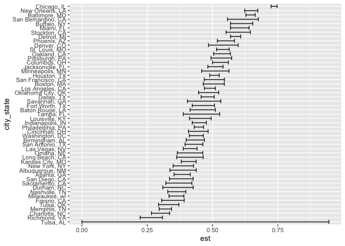
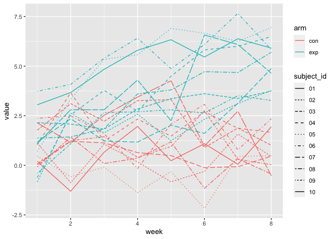
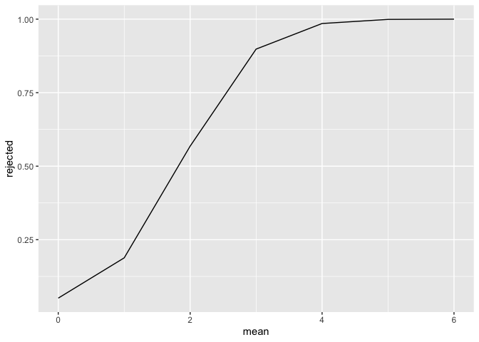
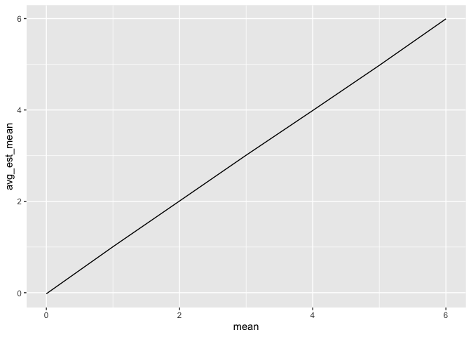
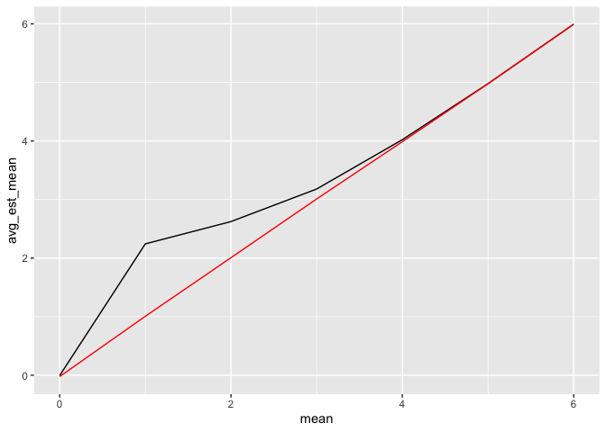

HW5: Markdown file
================
Kevin Liu
2023-11-12

# Problem 1

``` r
raw_homicide_data =
  read_csv("./data/homicide-data.csv") |> 
  janitor::clean_names()
```

    ## Rows: 52179 Columns: 12
    ## ── Column specification ────────────────────────────────────────────────────────
    ## Delimiter: ","
    ## chr (9): uid, victim_last, victim_first, victim_race, victim_age, victim_sex...
    ## dbl (3): reported_date, lat, lon
    ## 
    ## ℹ Use `spec()` to retrieve the full column specification for this data.
    ## ℹ Specify the column types or set `show_col_types = FALSE` to quiet this message.

**Describe the raw data**

- There are 52179 rows and 12 variables in the raw dataset.
- The 11 variables are “uid”, “reported_date”, “victim_last”,
  “victim_first”, “victim_race”, “victim_age”, “victim_sex”, “city”,
  “state”, “lat”, and “lon”.
  - Respectively their variable types: chr, num, chr, chr, chr, chr,
    chr, chr, chr, num, num, and chr.
  - The variables include full name of victim, their race, age, sex, the
    city and state and the coordinates of the homicide report and the
    date.

**Create a `city_state` variable**

``` r
raw_homicide_data = 
  raw_homicide_data |> 
  
  #Create variable "city_state" which is a concatenation of city + state separated by , .
  mutate(city_state = paste(city, state, sep = ", "))
```

**Summarize**

…within cities to obtain the total number of homicides and the number of
unsolved homicides.

``` r
sum_homicides =
  raw_homicide_data |> 
  
  #Group by city_state 
  group_by(city_state) |> 
  
  #Summarize total_homicides as # of data inputs in each city and num_unsolved the # of data with "Closed without arrest" and "Open/No arrest" as the string value for disposition
  summarize(total_homicides = n(), num_unsolved = sum(disposition %in% c("Closed without arrest", "Open/No arrest"))) 

head(sum_homicides, 10)
```

    ## # A tibble: 10 × 3
    ##    city_state      total_homicides num_unsolved
    ##    <chr>                     <int>        <int>
    ##  1 Albuquerque, NM             378          146
    ##  2 Atlanta, GA                 973          373
    ##  3 Baltimore, MD              2827         1825
    ##  4 Baton Rouge, LA             424          196
    ##  5 Birmingham, AL              800          347
    ##  6 Boston, MA                  614          310
    ##  7 Buffalo, NY                 521          319
    ##  8 Charlotte, NC               687          206
    ##  9 Chicago, IL                5535         4073
    ## 10 Cincinnati, OH              694          309

**For City of Baltimore, MD…**

…use the prop.test function to estimate the proportion of homicides that
are unsolved; save the output of prop.test as an R object, apply the
broom::tidy to this object and pull the estimated proportion and
confidence intervals from the resulting tidy dataframe.

``` r
#Extract Baltimore_MD data from the summarized data aobve
baltimore_prop = 
  sum_homicides |> 
  filter(city_state == "Baltimore, MD")

#Extract the number of unsolved and total homicides from baltimore dataset
balt_unsolved = baltimore_prop$num_unsolved
balt_total = baltimore_prop$total_homicides

#Use prop.test function on the unsolved and total homicides from baltimore
balt_proptest = 
  prop.test(balt_unsolved, balt_total) |> 
  
  #Tidy the propotional test output
  broom::tidy()

#Extract the proportion and confidence interval from balt_proptes
balt_est = balt_proptest$estimate
balt_ci_low = balt_proptest$conf.low
balt_ci_high = balt_proptest$conf.high
```

- *Proportion of Homicides Unsolved in Baltimore, MD*: 0.6455607
- *95%CI*: (0.6275625, 0.6631599)

**Now Run `prop.test` on each city…**

…in your dataset, and extract both the proportion of unsolved homicides
and the confidence interval for each. Do this within a “tidy” pipeline,
making use of purrr::map, purrr::map2, list columns and unnest as
necessary to create a tidy dataframe with estimated proportions and CIs
for each city.

``` r
#Function that runs prop.test for each city
run_prop_test = function(x) {
  result = 
    prop.test(x$num_unsolved, x$total_homicides) |> 
    broom::tidy()
  
  
  tibble(city_state = x$city_state,
         est = result$estimate,
         ci_low = result$conf.low,
         ci_high = result$conf.high)
}

#Create a list to iterate over 
homicide_list = split(sum_homicides, 1:nrow(sum_homicides))

#Create empty list to fill with 
prop_list = vector("list",51)
for (i in 1:51) {
  prop_list[[i]] = run_prop_test(homicide_list[[i]])
}
```

    ## Warning in prop.test(x$num_unsolved, x$total_homicides): Chi-squared
    ## approximation may be incorrect

``` r
#Convert list into dataframe
prop_df = bind_rows(prop_list)

head(prop_df, 10)
```

    ## # A tibble: 10 × 4
    ##    city_state        est ci_low ci_high
    ##    <chr>           <dbl>  <dbl>   <dbl>
    ##  1 Albuquerque, NM 0.386  0.337   0.438
    ##  2 Atlanta, GA     0.383  0.353   0.415
    ##  3 Baltimore, MD   0.646  0.628   0.663
    ##  4 Baton Rouge, LA 0.462  0.414   0.511
    ##  5 Birmingham, AL  0.434  0.399   0.469
    ##  6 Boston, MA      0.505  0.465   0.545
    ##  7 Buffalo, NY     0.612  0.569   0.654
    ##  8 Charlotte, NC   0.300  0.266   0.336
    ##  9 Chicago, IL     0.736  0.724   0.747
    ## 10 Cincinnati, OH  0.445  0.408   0.483

**Create a plot**

…that shows the estimates and CIs for each city – check out
geom_errorbar for a way to add error bars based on the upper and lower
limits. Organize cities according to the proportion of unsolved
homicides.

``` r
  prop_df |> 
  #arrange by estimate ascending
  arrange(est) |> 
  #redfine city_state to factors and ordered based on their arrangement by est
  mutate(city_state = factor(city_state, levels = city_state)) |> 
  ggplot(aes(x = city_state, y = est)) + 
  geom_errorbar(aes(ymin = ci_low, ymax = ci_high)) +
  #make xaxis label more clear
  coord_flip()
```

<!-- -->

# Problem 2

\##Create a tidy dataframe…

…containing data from all participants, including the subject ID, arm,
and observations over time:

**Start with a dataframe containing all file names;**

``` r
#Retrieve directory names to iterate over (List)
file_names = list.files("./data", pattern = "^(con|exp)", full.names = TRUE)

#Retrieve subject name from the file names (List)
sub_names = substr(file_names, 8,13)

#Iterate all file names and read_csv using map
subject_data_list = map(file_names,read_csv, show_col_types = FALSE)

#Convert list to dataframe, add subject id + arm
subject_data = 
  bind_rows(subject_data_list) |> 
  mutate(subject_id = substr(sub_names,5,6)) |> 
  mutate(arm = substr(sub_names, 1,3)) |> 
  select(subject_id, arm, everything()) |> 
  pivot_longer(
    week_1:week_8,
    names_to = "week",
    values_to = "value"
  ) |> 
  mutate(week = as.numeric(substr(week,6,6)))
```

**Make a spaghetti plot**

..showing observations on each subject over time, and comment on
differences between groups.

``` r
subject_data |> 
  ggplot(aes(x = week, y = value, color = arm, linetype = subject_id)) +
  geom_line()
```

<!-- -->
*Difference*

- It seems like those in the experimental, have an overall increasing
  trend and are somewhat have higher absolute values compared to control

# Problem 3

When designing an experiment or analysis, a common question is whether
it is likely that a true effect will be detected – put differently,
whether a false null hypothesis will be rejected. The probability that a
false null hypothesis is rejected is referred to as power, and it
depends on several factors, including: the sample size; the effect size;
and the error variance. In this problem, you will conduct a simulation
to explore power in a one-sample t-test.

*First set the following design elements:*

- Fix n = 30
- Fix sigma = 5

``` r
n = 30
sigma = 5
```

*Set μ=0 - Generate 5000 datasets from the model: x ~ N\[mu, sigma\]*

``` r
mu = 0
ttest_list = vector("list", 5000)
reject_zero_list = vector("numeric", 5000)
mean_zero_list = vector("numeric", 5000)
reject_mean_zero_list = vector("numeric", 5000)
for (i in 1:5000) {
  sample = rnorm(n, mean = mu, sd = sigma)
  t_test = t.test(sample, mu = 0, conf.level = 0.95) |> 
    broom::tidy()
  ttest_list[[i]] = tibble(
    est = t_test$estimate,
    pval = t_test$p.value
  )
  reject_zero_list[[i]] = ifelse(t_test$p.value < 0.05, 1,0)
  mean_zero_list[[i]] = t_test$estimate
  reject_mean_zero_list[[i]] = ifelse(t_test$p.value < 0.05, as.numeric(t_test$estimate),NA)
}
reject_zero = mean(reject_zero_list)
est_mean_zero = mean(mean_zero_list)
est_mean_reject_zero = mean(reject_mean_zero_list, na.rm = TRUE)
```

*Repeat the above for mu = {1,2,3,4,5,6}*

``` r
ttest_list_mu = list()
true_mu = c(1:6)

for (i in true_mu) {
  ttest_list_mu[[i]] = list()
  for (j in 1:5000) {
    sample = rnorm(n, mean = i, sd = sigma)
    t_test = t.test(sample, mu = 0, conf.level = 0.95) |>
      broom::tidy()
    ttest_list[[j]] = tibble(
      est = t_test$estimate,
      pval = t_test$p.value
    )
    # reject_cnt[[j]] = ifelse(t_test$p.value < 0.05, 1, 0)
    # est_list[[j]] = 
  }
  # rejected[[i]] = mean(ifelse(t_test$p.value < 0.05, 1,0))
  ttest_list_mu[[i]] = ttest_list
  print(i)
}
```

    ## [1] 1
    ## [1] 2
    ## [1] 3
    ## [1] 4
    ## [1] 5
    ## [1] 6

- Make a plot showing the proportion of times the null was rejected (the
  power of the test) on the y axis and the true value of μ on the x
  axis. Describe the association between effect size and power.

``` r
#Calculating proportion rejected for each true mean
rejected = vector("numeric", 6)

## Iterate over each true mean
for (i in true_mu) {
  #Create list to record rejected or not
  reject_true = vector("numeric", 5000)
  for (j in 1:5000) {
    #for each p-value within the ith mean check if rejected
    reject_true[j] = ifelse(ttest_list_mu[[i]][[j]][2] < 0.05, 1, 0)
  }
  #Calculate proportion rejected by taking mean of reject_true
  rejected[[i]] = mean(reject_true)
}
```

*Plot*

``` r
#Create effect size vs. power dataframe 
effect_size_power_df = tibble(
  mean = true_mu,
  rejected = rejected
) |> 
  #add mu = zero values
  add_row(mean = 0, rejected = reject_zero) |> 
  #rearrange
  arrange(mean)

#Plot effect size vs. power!
ggplot(effect_size_power_df, aes(x = mean, y = rejected)) +
  geom_line()
```

<!-- -->

    * As the effect size (true mu) increases, the power increases. 

- Make a plot showing the average estimate of μ̂ on the y axis and the
  true value of μ on the x axis. Make a second plot (or overlay on the
  first) the average estimate of μ̂ only in samples for which the null
  was rejected on the y axis and the true value of μ on the x axis. Is
  the sample average of μ̂ across tests for which the null is rejected
  approximately equal to the true value of μ? Why or why not?

``` r
mean_est = vector("numeric", 6)
for (i in true_mu) {
  mean_vals = vector("numeric", 5000)
  for (j in 1:5000) {
    mean_vals[[j]] = as.numeric(ttest_list_mu[[i]][[j]][1])
  }
  mean_est[[i]] = mean(mean_vals)
}
```

*Plot 1: All Estmated Mean vs. True Mean*

``` r
est_true_df = tibble(
  mean = true_mu,
  avg_est_mean = mean_est
) |> 
  add_row(mean = 0, avg_est_mean = est_mean_zero) |> 
  arrange(mean)

ggplot(est_true_df, aes(x = mean, y = avg_est_mean)) +
  geom_line()
```

<!-- -->

*Plot 2: Avg Estmated Mean when Rejected vs. True Mean*

``` r
est_mean_reject = vector("numeric", 6)
for (i in true_mu) {
  mean_rej = vector("numeric", 5000)
  for (j in 1:5000) {
    mean_rej[j] = ifelse(ttest_list_mu[[i]][[j]][2] < 0.05, as.numeric(ttest_list_mu[[i]][[j]][1]), NA)
  }
  est_mean_reject[[i]] = mean(mean_rej, na.rm = TRUE)
}
```

*Plot*

``` r
est_reject_df = tibble(
  mean = true_mu,
  avg_est_mean = est_mean_reject
) |> 
  add_row(mean = 0, avg_est_mean = est_mean_reject_zero) |> 
  arrange(mean)

ggplot(est_reject_df, aes(x = mean, y = avg_est_mean)) +
  geom_line() +
  geom_line(data = est_true_df, color ="red")
```

<!-- --> \*
The sample average of mu^ across tests for which the null is rejected is
approximately equal to the true value of mu as true mu gets larger
(effect size increases). Because as power increases, the more samples
reject null and thus the absolute sample size increases which allows the
mean estimate to approach the true mean due to larger sample
